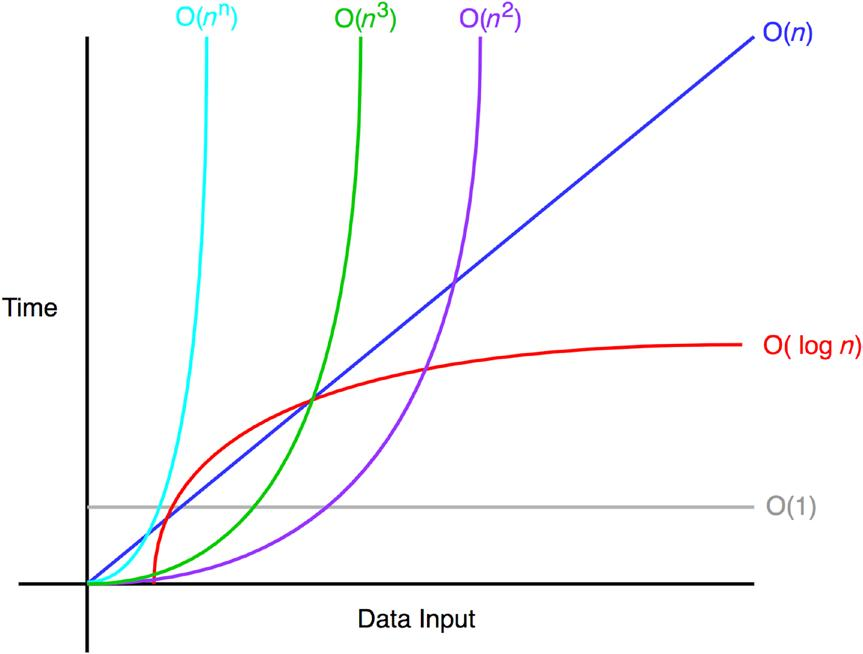

##### Big-O
The Big-O notation measures the worst-case complexity of an algorithm.
"What will happen as n approaches infinity?”

- O(1) does not change with respect to input space. Hence, O(1) is referred to as being
constant time.
- O(n) is linear time and applies to algorithms that must do n operations in the
worst-case scenario 
- O(n2) is quadratic time
- O(n3) is cubic time
- logarithmic time complexity is printing elements that are a power of 2 between 2 and n
        1 function exampleLogarithmic(n) {
        2                   for (var i = 2 ; i <=
        3                          console.log(i);
        4                  }
        5 }